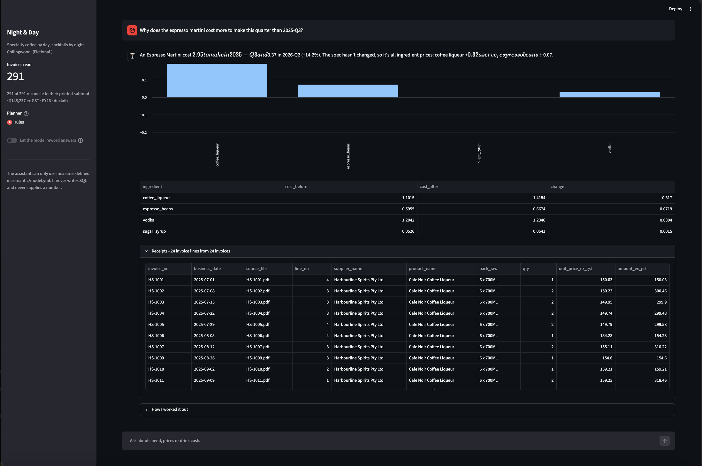

# Ask Your Invoices

**An AI analyst for a cafe-bar that can't make numbers up.** 

Built by Linh Ngan Nguyen (Master of Business Analytics). The idea comes from working in food and beverage at the Ritz-Carlton, where supplier invoices arrive every day and nobody has time to read them.

**Live demo:** https://ask-your-invoices-linh.streamlit.app/

Six suppliers, 326 invoices, five different invoice layouts. The app opens
on a dashboard: what the venue spent, whether that was price or volume, what
each of 33 drinks costs to pour, and what's worth a phone call to a supplier.
Every answer comes with the invoice lines that prove it, and the assistant
refuses anything it can't prove.



```
> Why does the espresso martini cost more to make this quarter than 2025-Q3?

An Espresso Martini cost $2.95 to make in 2025-Q3 and $3.37 in 2026-Q2 (+14.2%).
The spec hasn't changed, so it's all ingredient prices: coffee liqueur +$0.32 a
serve, espresso beans +$0.07.

Receipts: 24 invoice lines from 24 invoices (HS-1001, HS-1002, ...)
```

## Why it's built this way

Most "chat with your data" tools let a language model write SQL. The model
guesses what "cost" means, the answer looks plausible, and nobody can check it.
This one is built the other way round:

| | |
| --- | --- |
| **The model never writes SQL** | It picks a plan from a fixed catalogue. The semantic layer writes the SQL. |
| **The model never supplies a number** | Answers are written from the result. If a model rewords them, any figure not in the result gets the rewrite thrown away. |
| **Units are part of the model** | Price per unit across litres and kilos is refused, not averaged. |
| **Drinks are part of the model** | Cost per serve is only defined per drink; pour cost across drinks is allowed and says what it assumes. |
| **Every answer has receipts** | Drill-through to invoice, page and line. A test proves the receipts add up to the answer. |

## What's inside

```
make_invoices.py        a year of invoices from 6 fictional suppliers, 5 layouts
creep/                  PDF reader and pack-size parser (from Price Creep)
askinv/ingest.py        PDFs -> star schema in DuckDB, with lineage on every line
semantic/model.yml      the semantic layer: 2 datasets, 9 measures, 10 dimensions
semantic/recipes.yml    33 drink specs; how invoices become cost per serve
semantic/categories.yml product categories, as editable business rules
askinv/layer.py         the compiler, the unit/drink guards, drill-through
askinv/menu.py          invoices -> ingredient prices -> cost per drink
askinv/bridge.py        why spend changed: price, volume, new, stopped
askinv/planner.py       English -> checked plan (rules, or Gemini free tier)
askinv/answer.py        plan -> sentence + table + receipts; the number checker
evals/                  planning accuracy, refusals, and number grounding
app.py                  Streamlit chat
| Screen | What it answers |
| --- | --- |
| **Overview** | How is the venue doing? Spend against last quarter, split into price and volume, pour cost by drink type, biggest movers, what needs a phone call. |
| **Ask** | Anything the semantic layer can prove, with the invoice lines behind it. |
| **Analytics** | Spend by month, supplier, category and product; price per litre or kilo over time. Every table downloads as CSV. |
| **Alerts** | Price rises, pack shrinks and cheaper alternatives, with the dollar impact a year and the drinks each one hits. |
| **Invoice inbox** | Drop in today's PDFs: do the lines add up, has any price moved, which drinks would feel it. |
| **Recipes** | 33 specs, costed at the prices actually paid, with a what-if editor. |
```

## Run it

```bash
python -m venv .venv && source .venv/bin/activate
pip install -r requirements.txt
python make_invoices.py      # 326 invoice PDFs + ground truth
python -m askinv.ingest      # read them into the warehouse, cost the menu
pytest -q                    # 41 tests
python -m evals.run_evals
streamlit run app.py
```

No API key needed. Set `GEMINI_API_KEY` (Google AI Studio free tier) to try the
model planner and model wording.

## Results

- **Extraction**: 1,529 of 1,529 invoice lines read exactly; all 326 invoices
  reconcile to their printed subtotal.
- **Planning** (rules planner): 16/16 answerable questions planned correctly,
  6/6 out-of-scope questions refused, 3/3 unsafe questions stopped by the layer.
- **Number grounding**: 5/5 rewrites with invented figures rejected, 3/3 honest
  rewrites kept.

**Read these honestly.** I wrote the eval questions and the planner rules, so
100% is the best case, not the result. The real number comes from a held-out set written
by people who haven't seen the vocabulary - `evals/heldout.yml` is where it goes.

- **Held-out** (questions written by people who hadn't seen the app): 2/3
  planned correctly, 1/1 refused, 1/1 stopped by the layer. The miss: "Is
  Northside cheaper than Bar & Barista for oat milk?" was answered with total
  spend at one supplier instead of comparing price per litre across both.


### Held-out questions

Seven questions from people who had never seen the app, and five they'd want
answered.

| | Before | After |
|---|---|---|
| Answerable, right plan | 2/5 | 2/5 |
| Out of scope, refused | 1/7 | 7/7 |

Six questions were being answered with the nearest available number rather than
refused. "How fast does each supplier deliver?" returned spend by supplier;
"can you check the goods were delivered?" returned total spend. The planner never
said it didn't know how - it picked its default measure and answered anyway.
Each of those is now a permanent refusal case in `evals/questions.yml`.

The two remaining misses are capability gaps, not wording ones: comparing two
suppliers for the same product, and finding products bought from more than one
supplier. Both are answered on the Alerts screen; neither is reachable from the
chat yet.

## What the data shows

- Coffee pour cost rose from 19.6% to 22.1% across FY26; cocktails from 17.3%
  to 18.2%. Coffee is getting dearer to make faster than cocktails.
- The Espresso Martini costs 14% more to make than at the start of the year,
  almost all of it coffee liqueur.
- Tequila moved from 750ml to 700ml bottles at the same case price - visible
  only because everything is priced per litre.
- - Oat milk costs about $2.95 a litre from Bar & Barista and $3.35 from
  Northside Dairy, for the same product. Buying it all from one supplier
  would save about 40c a litre.
- Chai concentrate has crept up 25% a litre over the year, about $886 a year at
  current volumes, and it lands on exactly one drink: the chai latte.
- Switching the sours from egg white to a vegan foamer took about 40c off every
  sour, visible immediately because the spec is data, not code.

## Data

Entirely synthetic. Night & Day and all five suppliers are invented.
